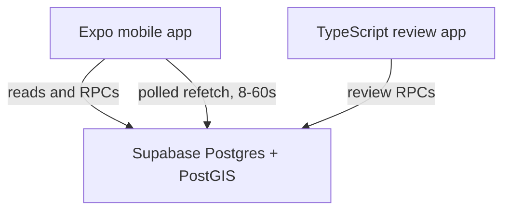

# Architecture

Derived from the project's canonical reference document. Keep a copy at
`docs/reference.md`; where this file and the reference disagree, the reference wins and this file
needs updating.

Product rules live in [product-rules.md](product-rules.md). Decision records are in
[decisions/](decisions/).

---

## System



**Postgres is the source of truth for business rules.** Mobile and admin do not duplicate merge,
dedup, or check-in validation logic. Reads may go directly to Supabase under RLS; writes that
carry validation or touch several tables go through database functions so they are transactional.

The service-role credential never appears in a mobile or browser bundle. `scripts/check-client-bundles.mjs`
enforces this in CI, and it self-tests so a broken check fails loudly rather than passing everything.

### Freshness is polled, not pushed

Supabase Realtime is **not currently used** — there are no `.channel()` subscriptions in either
client. Live figures come from React Query `refetchInterval`: 15 s for venue activity and presence,
8 s for session chat, 30–60 s for slower lists. `AppState` invalidates everything on foreground.

Whichever mechanism delivers the signal, the rule that matters is unchanged: **refetch the
authoritative aggregate, never increment local state.** A count assembled client-side drifts, and a
drifting count is worse than one that reloads.

`docs/reference.md` §11 still describes the region-filtered Realtime design. Treat it as the
intended destination, not as a description of the code. Moving to it is worthwhile when polling
cost or latency justifies it; the refetch-on-signal shape is deliberately identical either way, so
the switch touches the subscription, not the screens.

---

## Access control

Two independent mechanisms, both required:

- **GRANTs** decide which operations a role may attempt
- **RLS** decides which rows it may touch

Supabase grants default privileges on new `public` tables to `anon` and `authenticated`, so every
migration explicitly revokes first. A table added without RLS is the most likely way this project
would leak data, so a pgTAP test asserts that **no public table lacks RLS**.

`profiles` shows why both matter. Every row is selectable — you need to see other players' names.
But `home_region_id` and `onboarding_completed_at` are private, and RLS is row-level, so it cannot
express "this column, but only for me". A **column-level grant** narrows `anon`/`authenticated` to
`(id, display_name, avatar_path)`, and `current_profile()` gives the owner their own full row.

`is_admin()` is `SECURITY DEFINER` for a load-bearing reason, not out of habit: `admin_users`
denies SELECT to everyone, so a policy calling it as the invoker would see zero rows and every
admin check would silently return false.

There is **no API path that grants admin** — no INSERT policy on `admin_users` for anyone,
including admins. Promotion requires a privileged connection (`npm run db:admin`), which is what
makes escalation auditable.

---

## Venue data lifecycle

Automated OSM importing is deferred and the unfinished Python tool was removed in `b63c492`.

**The staging tables were never created.** `venue_candidates` exists, because user submissions need
it, but there are no `import_batches`, `source_records` or venue-to-source link tables in any
migration. The pipeline below is the intended design, not the current schema — building it means
writing those tables, not reconnecting existing ones.

```
Overpass API
     │  importer, per region bbox          ── not built
     ▼
staging  ── raw OSM tags preserved verbatim, nothing trusted   ── not built
     │  human review: name, classify sport, merge, reject
     ▼
venues   ── published; what the app reads                      ── exists
```

Today the only route into `venues` is a user submission reviewed through
`admin_review_candidate()`, plus the four Charlottetown venues written by hand in
`20260909000000_charlottetown_venues.sql`.

Three concepts are meant to keep provenance durable across re-imports:

- **import batches** — one execution against one region _(not built)_
- **source records** — latest raw representation of each external feature _(not built)_
- **venue candidates** — reviewable proposals: approve, reject, or merge into an existing venue
  _(built)_

One venue may link to several OSM records (a park with two courts). One OSM record may be
rejected outright. Published venues are never overwritten automatically by source data.

**A venue is a destination a player would recognise and check into** — not one OSM object. Two
facilities are not one venue merely because they are within 40 m.

### Why the alias table has three states

`osm_sport_aliases` maps a normalized OSM token to one of our sports, _or_ records that we
deliberately ignore it. The third state is the absence of a row, meaning **unknown**, which must
surface to a human. Without it, a new OSM tag vanishes silently and nobody learns the data changed.

The token normalization this depends on is not theoretical. Live Overpass data contains
`tennis; basketball` — with a space — alongside `soccer;basketball` and
`seven-a-side;five-a-side;soccer`. A database CHECK constraint rejects any alias that is not a
single lowercased, trimmed token, so a normalization bug fails loudly at write time instead of
quietly losing sports.

### Deduplication

`find_duplicate_candidates()` lives in Postgres rather than in the importer, because user
submissions arrive through the app and would never reach importer-side logic. One definition, one
threshold, both entry points.

Three distances, three jobs:

| Distance | Used for                                                 |
| -------- | -------------------------------------------------------- |
| 150 m    | prevention list shown before a user submits              |
| 100 m    | server-side candidate search on submission               |
| 40 m     | high-confidence review band, calibrated on Charlottetown |

Distance alone never decides. Ranking also uses shared sports, name/alias similarity,
indoor/outdoor agreement, and shared source or address evidence. **No automatic merging, ever** —
adjacent courts may be separate destinations, and only a local can tell.

**Venue-to-venue merging is not implemented yet.** `merge_venues()` does not exist. What exists is
`admin_review_candidate(..., 'merge', target_venue_id)`, which folds an incoming _submission_ into
an existing venue by recording its proposed name as an alias and adding its sports. That handles
the duplicate-submission case, which is the one users actually generate.

Merging two already-published venues remains open. When it is built it must move references rather
than delete: check-ins already point at the loser row, so it survives as a pointer
(`merged_into_venue_id`) with its name preserved as an alias, and cycles and chains must be
rejected. `merged_into_venue_id`, the `merged` status and the single-hop resolution in
`venue_details()` exist in the schema from the start for exactly this reason — retrofitting them
after check-ins exist means a migration plus a backfill plus touching every read. Nothing writes
that column today, so the `merged` status is currently unreachable.

---

## Maps and third-party data

OSM data is free; OSM _infrastructure_ is not a production dependency you get for free.

- Community tile servers are capacity-limited, require attribution and identification, and
  prohibit bulk prefetch. Keep the tile URL configurable so it can move providers without a code
  release. See the [tile usage policy](https://operations.osmfoundation.org/policies/tiles/).
- Geoapify handles explicit venue **search** (`features/geocoding/geoapify.ts`), with provider
  attribution. Search results position a draft pin; the final user-confirmed coordinates are stored
  in Supabase. Client caching and request spacing conserve credits but do not enforce project-wide
  quotas.
- Human reviewers provide the initial Charlottetown display names. This is not a fallback — for
  ~90 venues in a city you know, it produces better names than any geocoder would.
- **Map rendering is Mapbox on every platform**: `@rnmapbox/maps` natively and `mapbox-gl` on web,
  behind the `VenueMap` seam (`components/map/venue-map.tsx` and its `.web.tsx` twin) so the
  provider can still change. `react-native-maps` is not a dependency. The token is
  `EXPO_PUBLIC_MAPBOX_ACCESS_TOKEN`; apply provider URL restrictions to it.
- Display OSM attribution wherever venue data appears.

---

## Environments

App development uses hosted Supabase. Migrations remain versioned in the repository.
A separate hosted test project contains synthetic fixtures and transactional pgTAP
checks; it must never share the app database. PR checks build with offline
placeholder configuration. See the README for commands and credentials.

---

## Build sequence

The phases below were not completed strictly in order. Phases 2–5 and an unplanned session-community
layer were built on top of a Phase 1 that is still open, so read the status lines rather than
assuming everything earlier in the list is finished.

**Phase 0 — repository and database foundation. Complete.**
Monorepo, migrations, generated types, CI and app shells.
_Current development and verification instructions are in the README._

**Phase 1 — venue data foundation. Partly built.**
Candidates, venues, aliases and audit exist, with PostGIS indexes and `find_duplicate_candidates()`.
The admin review queue and transactional approve/reject RPCs exist.
_Not done:_ automated import tooling is deferred and the unfinished Python tool was removed, so the
staging tables (import batches, source records, source links) were never created; there is no
venue-to-venue `merge_venues()`; the second region is not seeded. The four published Charlottetown
venues were written by hand in `20260909000000_charlottetown_venues.sql`, not imported.
_Exit (unmet): raw OSM becomes a clean reviewed Charlottetown venue list without hand-editing tables._

**Phase 2 — read-only mobile discovery. Built.**
Auth and onboarding, map/list, sport filters, venue detail, loading/empty/permission-denied states.
_Exit: a user can find a reviewed venue and see which sports it supports._

**Phase 3 — live check-in vertical slice. Built, with one substitution.**
Location permission, check-in/extend/checkout/expiry RPCs, live counts, RLS and concurrency rules.
Freshness is **polled**, not delivered by region-filtered Realtime — see §Freshness is polled, not
pushed. Beyond the plan, this phase also gained arrival intents, venue conditions and venue pulse.
_Exit: two devices see a check-in appear and disappear correctly, with no duplicate active
check-ins for one user. Unverified — the pgTAP suite has no test project to run against._

**Phase 4 — scheduled runs. Built except renewal.**
Series creation, bounded occurrence queries, exceptions, per-occurrence edit and cancel.
_Not done:_ there is no renewal or series-level edit RPC, so a lapsed series cannot be revived.
_Exit (partly unmet): DST-safe upcoming runs work; expired series vanish without being deleted, but
cannot be renewed._

**Phase 5 — user venue submissions. Built.**
Nearby-venue prevention step, submission form, private status view, duplicate flags in review.
_Exit: an untrusted submission never becomes public without an authorized review decision._

**Unplanned — dated-session community. Built.**
Memberships, private session chat, the public regional post feed, and proximity-checked session
photos. Described in `docs/product-rules.md` §Session community and `docs/session-photos.md`; it has
no phase of its own in this list because it was not in the original sequence.

---

## Second-region smoke test (deferred)

When import tooling is implemented, run it against one denser region, kept unpublished. It passes when:

- no region-specific constants appear in importer code
- batching and timeout behaviour stay safe on a larger response
- unknown tokens are surfaced
- re-running produces no duplicate source records or candidates
- no review or publication burden is created for that region

Halifax is seeded for this (`is_published = false`): bigger, denser, spans a harbour — different
enough from Charlottetown to actually test the parameterization.
