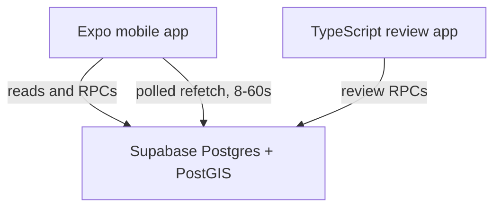

# Architecture

Current system structure. Database rules are defined in `supabase/migrations/`
and checked in `supabase/tests/`. Open work is tracked in [TODO](../TODO.md).

## System

**Postgres is the source of truth for business rules.** Mobile and admin do not duplicate merge,
dedup, or check-in validation logic. Reads may go directly to Supabase under RLS; writes that
carry validation or touch several tables go through database functions so they are transactional.

The service-role credential never appears in a mobile or browser bundle. `scripts/check-client-bundles.mjs`
enforces this in CI, and it self-tests so a broken check fails loudly rather than passing everything.

### Freshness is polled, not pushed

Supabase Realtime is **not currently used** — there are no `.channel()` subscriptions in either
client. Live figures come from React Query `refetchInterval`: 15 s for venue activity and presence,
8 s for session chat, 30–60 s for slower lists. `AppState` invalidates everything on foreground.

Whichever mechanism delivers the signal, the rule that matters is unchanged: **refetch the
authoritative aggregate, never increment local state.** A count assembled client-side drifts, and a
drifting count is worse than one that reloads.

## Access control

Two independent mechanisms, both required:

- **GRANTs** decide which operations a role may attempt
- **RLS** decides which rows it may touch

Supabase grants default privileges on new `public` tables to `anon` and `authenticated`, so every
migration explicitly revokes first. A table added without RLS is the most likely way this project
would leak data, so a pgTAP test asserts that **no public table lacks RLS**.

`profiles` shows why both matter. Every row is selectable — you need to see other players' names.
But `home_region_id` and `onboarding_completed_at` are private, and RLS is row-level, so it cannot
express "this column, but only for me". A **column-level grant** narrows `anon`/`authenticated` to
`(id, display_name, avatar_path)`, and `current_profile()` gives the owner their own full row.

`is_admin()` is `SECURITY DEFINER` for a load-bearing reason, not out of habit: `admin_users`
denies SELECT to everyone, so a policy calling it as the invoker would see zero rows and every
admin check would silently return false.

There is **no API path that grants admin** — no INSERT policy on `admin_users` for anyone,
including admins. Promotion requires a privileged connection (`npm run db:admin`), which is what
makes escalation auditable.

---

## Venue data lifecycle

User submissions create private `venue_candidates`. Admin review can approve,
reject, or link a candidate to an existing venue through `admin_review_candidate()`.
The repository also seeds four manually named Charlottetown venues in
`20260909000000_charlottetown_venues.sql`.

There is no automated importer or import staging pipeline.

### Deduplication

`find_duplicate_candidates()` ranks nearby venues in Postgres for submission
and admin review.

Three distances, three jobs:

| Distance | Used for                                                 |
| -------- | -------------------------------------------------------- |
| 150 m    | prevention list shown before a user submits              |
| 100 m    | server-side candidate search on submission               |
| 40 m     | high-confidence review band, calibrated on Charlottetown |

Distance alone never decides. Ranking also uses shared sports, name/alias similarity,
indoor/outdoor agreement, and shared source or address evidence. **No automatic merging, ever** —
adjacent courts may be separate destinations, and only a local can tell.

**Venue-to-venue merging is not implemented yet.** `merge_venues()` does not exist. What exists is
`admin_review_candidate(..., 'merge', target_venue_id)`, which folds an incoming _submission_ into
an existing venue by recording its proposed name as an alias and adding its sports. That handles
the duplicate-submission case, which is the one users actually generate.

## Maps and third-party data

- Geoapify handles explicit venue **search** (`features/geocoding/geoapify.ts`), with provider
  attribution. Search results position a draft pin; the final user-confirmed coordinates are stored
  in Supabase. Client caching and request spacing conserve credits but do not enforce project-wide
  quotas.
- **Map rendering is Mapbox on every platform**: `@rnmapbox/maps` natively and `mapbox-gl` on web,
  behind the `VenueMap` seam (`components/map/venue-map.tsx` and its `.web.tsx` twin) so the
  provider can still change. `react-native-maps` is not a dependency. The token is
  `EXPO_PUBLIC_MAPBOX_ACCESS_TOKEN`; apply provider URL restrictions to it.
- Display OSM attribution wherever venue data appears.

---

## Environments

App development uses hosted Supabase. Migrations remain versioned in the repository.
Database tests require a separate hosted test project with synthetic fixtures and
transactional pgTAP checks; it must never share the app database. PR checks build with offline
placeholder configuration. See the README for commands and credentials.
